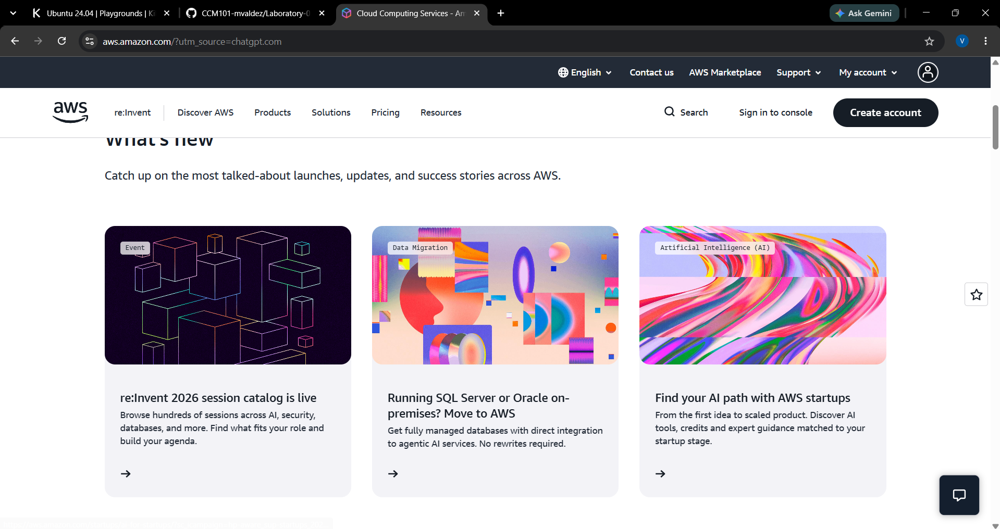

# AWS Research

## Brief Overview

Amazon Web Services (AWS) is a cloud computing platform provided by Amazon. It offers cloud services for computing, storage, databases, networking, security, and other workloads.

## Global Infrastructure

AWS uses a global infrastructure made up of Regions and Availability Zones. This allows organizations to deploy applications and resources in different geographic locations.

## Cloud Management Console

The AWS Management Console is a web-based interface used to access and manage AWS services and resources.

## Four Core Services

1. **Amazon EC2** – Provides virtual servers for running applications.
2. **Amazon S3** – Provides object storage for files and data.
3. **Amazon RDS** – Provides managed relational databases.
4. **AWS IAM** – Manages identities and access to AWS resources.

## Three Advantages

1. AWS provides a wide range of cloud services.
2. AWS has a global cloud infrastructure.
3. AWS can support different types and sizes of organizations.

## Typical Enterprise Use Cases

AWS can be used for web applications, data storage, databases, backup and recovery, application development, and enterprise systems.

## Screenshot

## References

- Amazon Web Services. (n.d.). *About AWS*. https://aws.amazon.com/about-aws/
- Amazon Web Services. (n.d.). *AWS global infrastructure*. https://aws.amazon.com/about-aws/global-infrastructure/
- Amazon Web Services. (n.d.). *AWS management console*. https://aws.amazon.com/console/
