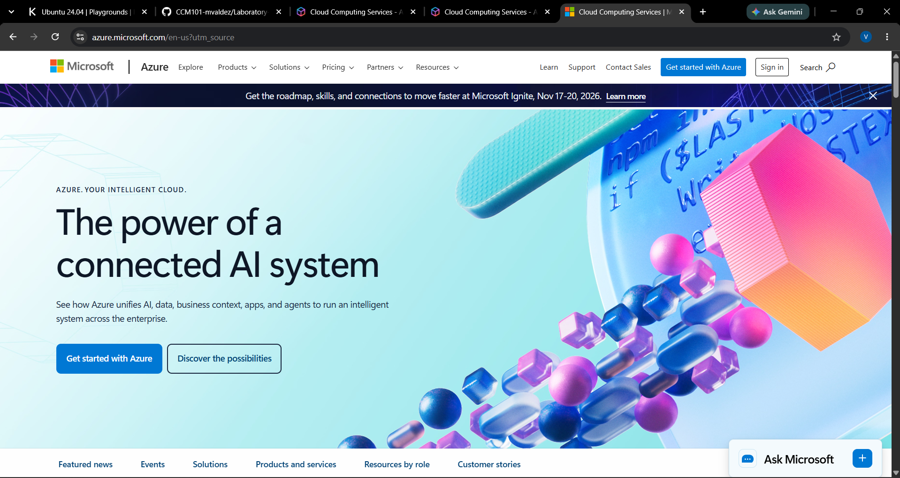

# Microsoft Azure Research

## Brief Overview

Microsoft Azure is a cloud computing platform developed by Microsoft. It provides services for computing, storage, databases, networking, security, analytics, and application development.

## Global Infrastructure

Azure uses regions and availability zones around the world. Its global infrastructure allows organizations to deploy applications and resources in different geographic locations.

## Cloud Management Console

The Azure portal is a web-based management interface used to create, configure, monitor, and manage Azure resources.

## Four Core Services

1. **Azure Virtual Machines** – Provides virtual machines for running applications.
2. **Azure Blob Storage** – Provides object storage for unstructured data.
3. **Azure SQL Database** – Provides a managed relational database service.
4. **Microsoft Entra ID** – Provides identity and access management.

## Three Advantages

1. Azure integrates well with Microsoft technologies.
2. Azure provides a large global infrastructure.
3. Azure offers many services for enterprise organizations.

## Typical Enterprise Use Cases

Azure can be used for enterprise applications, virtual machines, databases, storage, backup, analytics, and hybrid cloud environments.

## Screenshot

## References

- Microsoft Azure. (n.d.). *Azure*. https://azure.microsoft.com/
- Microsoft Learn. (n.d.). *Azure regions and availability zones*. https://learn.microsoft.com/en-us/azure/reliability/regions-overview
- Microsoft Azure. (n.d.). *Azure portal*. https://portal.azure.com/
