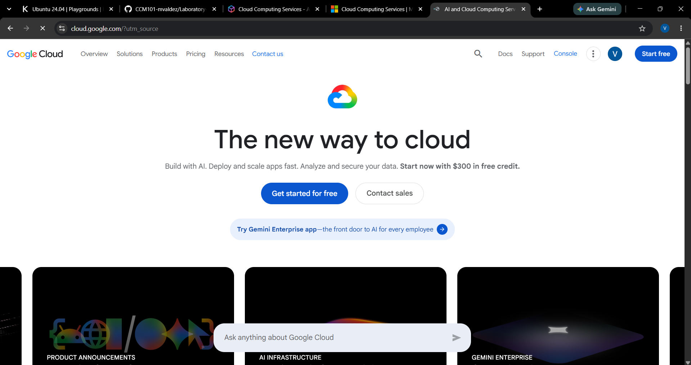

# Google Cloud Platform Research

## Brief Overview

Google Cloud is Google's cloud computing platform. It provides services for computing, storage, databases, networking, data analytics, artificial intelligence, and application development.

## Global Infrastructure

Google Cloud uses regions and zones to provide cloud infrastructure around the world. These locations allow organizations to deploy resources in different geographic areas.

## Cloud Management Console

The Google Cloud Console is a web-based interface used to manage Google Cloud resources and services.

## Four Core Services

1. **Compute Engine** – Provides virtual machines.
2. **Cloud Storage** – Provides scalable object storage.
3. **Cloud SQL** – Provides managed relational databases.
4. **Google Kubernetes Engine (GKE)** – Provides managed Kubernetes clusters.

## Three Advantages

1. Google Cloud provides strong data and analytics capabilities.
2. Google Cloud offers artificial intelligence and machine learning services.
3. Google Cloud provides managed Kubernetes through GKE.

## Typical Enterprise Use Cases

Google Cloud can be used for artificial intelligence, machine learning, data analytics, web applications, containerized applications, and databases.

## Screenshot

## References

- Google Cloud. (n.d.). *Google Cloud*. https://cloud.google.com/
- Google Cloud. (n.d.). *Cloud locations*. https://cloud.google.com/about/locations
- Google Cloud. (n.d.). *Google Cloud console*. https://console.cloud.google.com/
